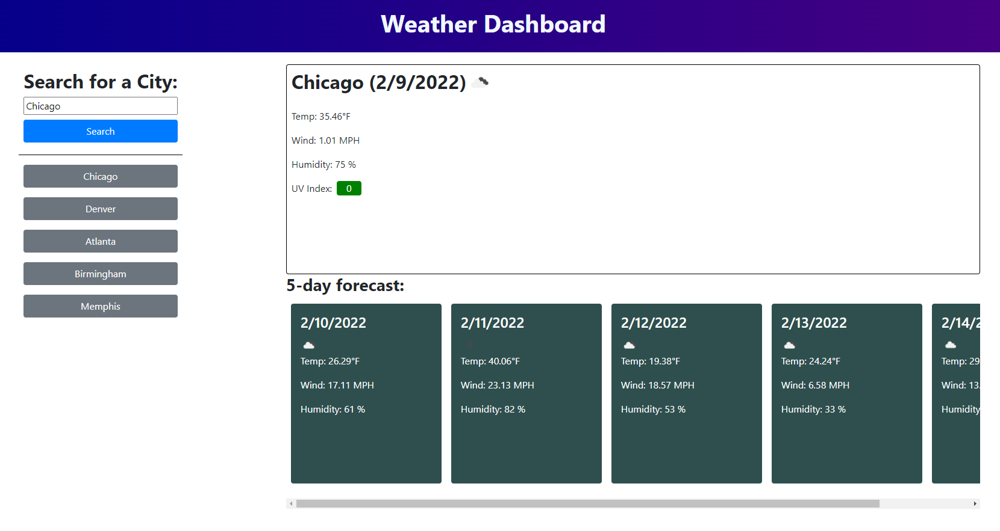

# Welcome to my weather dashboard!

## Once loaded, enter a city into the search to get started.
 - If the city is valid with the OpenWeather Geocoding and One Call API, you will see a forecast for the city appear in the containers to the right.
 - In the top container, you will see a current forecast of the area.
 - In the bottom container, you will see some forecast cards that tell the weather for the next five days. Nifty, huh?

## Save your searches for later!
 - When you search a city with the weather dashboard, it will be saved into a list of buttons on the right that will be saved to your device's local storage. When you come back later, they will still be there. Talk about convenient!

## Link to deployed application: [https://wingram1.github.io/weather-dashboard/](https://wingram1.github.io/weather-dashboard/)